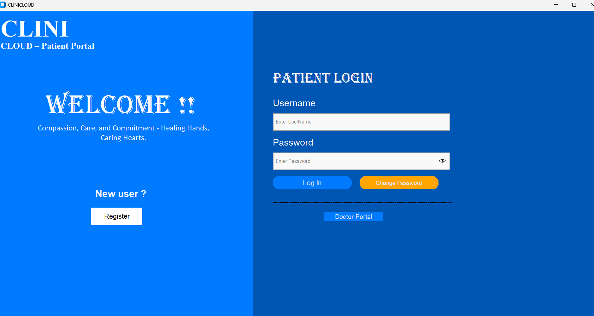
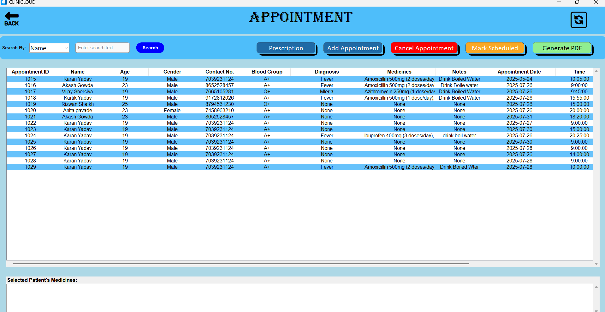
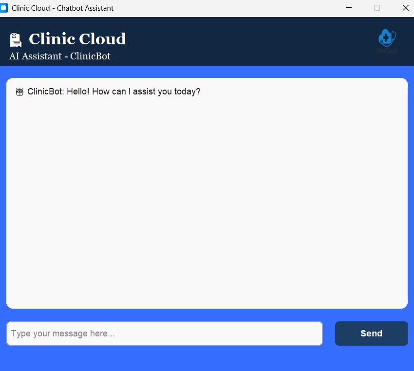
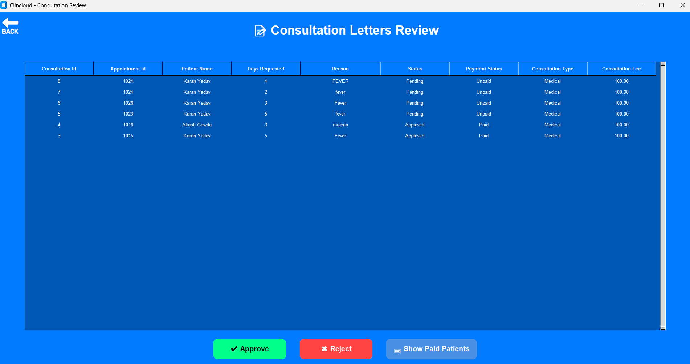
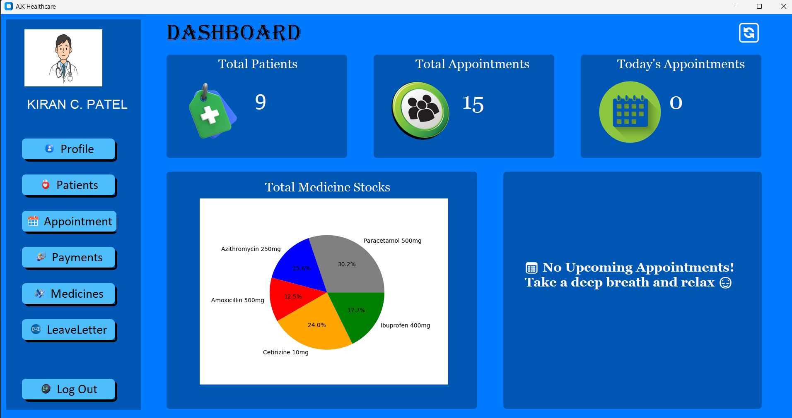
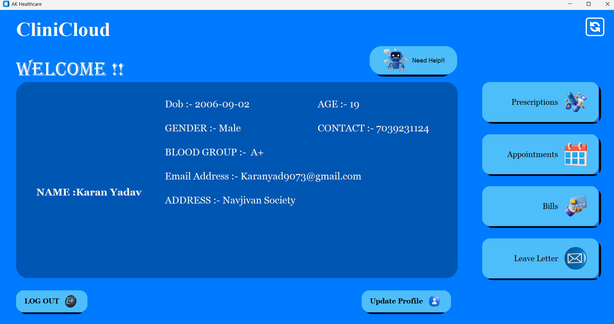
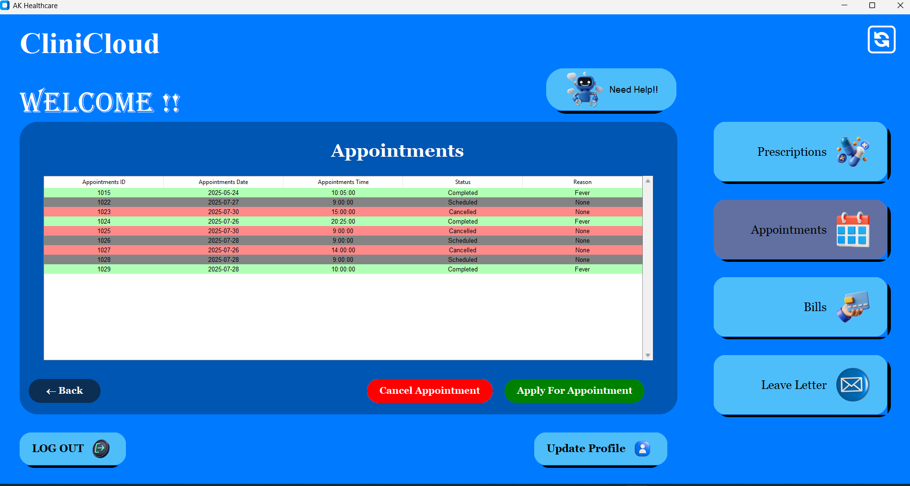
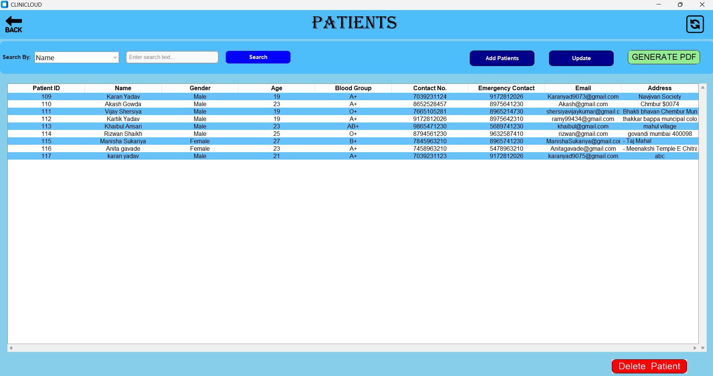
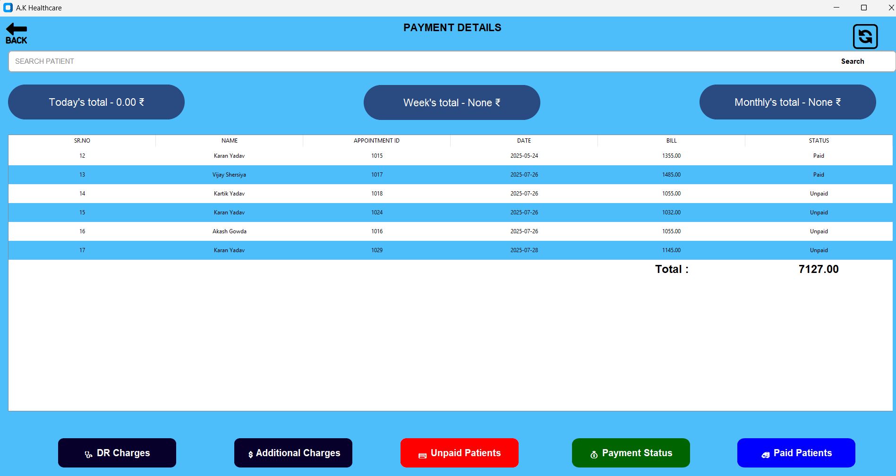

# 🏥 Clinic Management System

A desktop-based Clinic Management System developed using Python, Tkinter (CustomTkinter), and MySQL.
This project is designed to help clinics manage patients, doctors, appointments, prescriptions, medicines, payments, and consultation workflows efficiently through an easy-to-use GUI.

This project was built as part of my learning and practical implementation of database-driven GUI applications.

🚀 Key Features
👨‍⚕️ Doctor / Admin Dashboard
Doctor dashboard with statistics
View and manage appointments
Manage patients and their records
Add & manage medicines
View payments and billing details
Doctor profile management

👤 Patient Dashboard
Patient login & dashboard
View appointments
View prescriptions
View consultation status

📅 Appointment Management
Book new appointments
View upcoming appointments
Manage patient appointment data

💊 Prescription & Consultation
Create and update prescriptions
Add multiple medicines
Diagnosis and notes support
Consultation approval & cancellation
Auto calculation of medicine cost + base fee

🤖 Chatbot (Admin Controlled)
Clinic chatbot for basic assistance
Admin/doctor can take control when needed

🛠 Tech Stack Used

Language: Python
GUI Framework: Tkinter / CustomTkinter
Database: MySQL
Database Connector: PyMySQL
Charts & Stats: Matplotlib

🖼 Application Screenshots

⚙️ Installation & Setup
1️⃣ Clone the Repository
git clone https://github.com/Shunya-karan/CLINIC-MANAGMENT.git

2️⃣ Install Required Libraries
pip install pymysql matplotlib customtkinter

3️⃣ Database Setup

Create a MySQL database

Import required tables

Update database credentials in the project files

4️⃣ Run the Application
python main.py

📌 Project Purpose

This project was created to:
Practice Python GUI development
Work with real-world database relationships
Understand clinic workflow automation
Build a complete desktop application

🔮 Future Enhancements
Role-based authentication
PDF export for prescriptions
Dark mode UI
Email/SMS notifications
Cloud database support

👨‍💻 Author

Karan Yadav
📍 India
🔗 GitHub: https://github.com/Shunya-karan

⭐ If you like this project, consider giving it a star! ⭐
